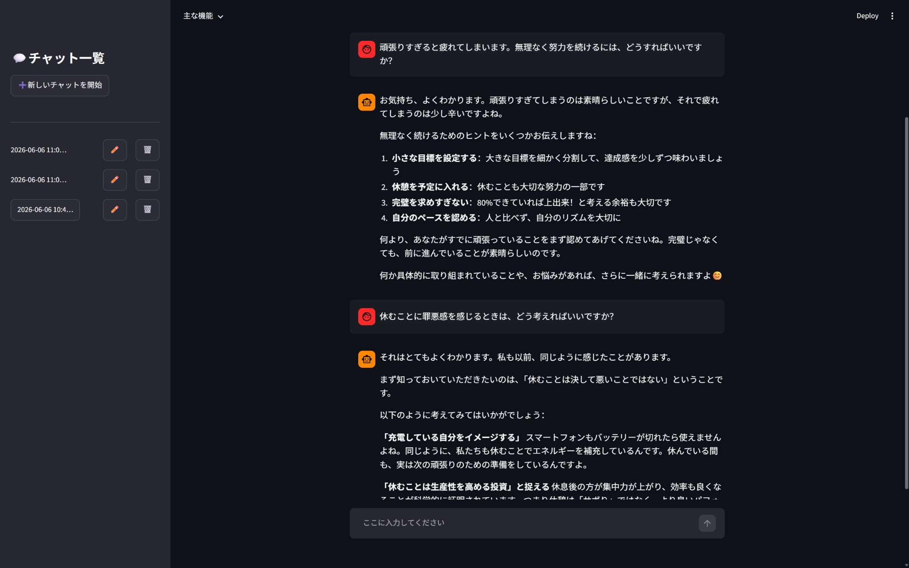
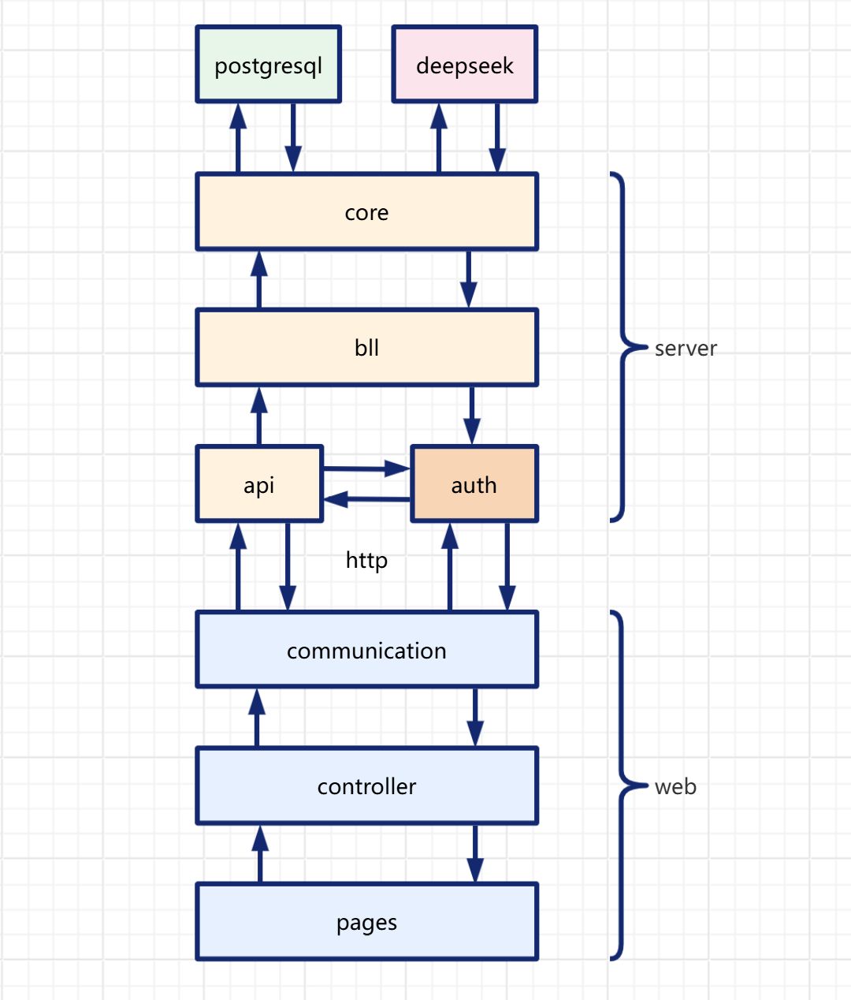

# My Chatbot

[中文](README.md) | [日本語](README_ja.md)

<p align="center">  </p>

## プロジェクト概要

特に良い名前が思いつかなかったため、シンプルに「My Chatbot」としました。

2025年6月に、LangChainやLangGraphを学びながら、約1か月かけて開発した対話型AIの個人プロジェクトです。

以前から対話型AIに興味があり、学習した内容を実際に試してみたいと考え、日常的な会話ができるチャットシステムを作成しました。高度な専門機能を備えたAIではなく、気軽に会話するためのシンプルなチャットボットです。

一方で、Web画面、HTTP API、ユーザー認証、チャットセッション管理、データベース、大規模言語モデルとの連携を分け、できるだけ役割が分かりやすい構成になるようにしました。

このリポジトリは、主に自分の学習過程と成長を記録するために公開しています。コードには改善できる部分もあります。

## 主な機能

* 簡易的なユーザー登録・ログイン機能
* JWTを利用したAPI認証
* AI回答のストリーミング表示
* 複数ターンの会話と履歴保存
* ユーザーごとの複数チャットセッション管理
* セッションの作成、選択、名前変更、削除
* 長くなった会話内容の自動要約
* 英語、簡体字中国語、繁体字中国語、日本語の画面表示
* 選択した言語に応じたAI回答言語の切り替え
* 言語設定とセッション情報のデータベース保存

## システム構成

フロントエンドとバックエンドを分け、さらに役割ごとにレイヤーを分けています。Streamlitで作成したWebクライアントから、HTTP APIを通してチャットサービスと認証サービスにアクセスします。

<p align="center">  </p>

### Webクライアント

* **`pages`**
  Streamlitを使用し、ログイン、ユーザー登録、プロジェクト紹介、チャット画面を実装しています。

* **`controller`**
  画面操作、入力内容の確認、状態判定、処理結果の表示などを担当します。画面表示と通信処理を分けるための層です。

* **`communication`**
  HTTPを使用してバックエンドAPIにアクセスし、ログイン、ユーザー登録、ユーザー情報取得、チャット、セッション管理などを行います。

### サーバー

* **`api`**
  チャット、ストリーミング回答、履歴取得、セッションの作成・削除・名前変更などのAPIを提供します。

* **`auth`**
  FastAPI Usersを使用し、ユーザー登録、ログイン、JWT認証、ユーザー情報管理を行います。

* **`bll`**
  チャットに関するビジネスロジックをまとめ、API層とLangGraphを使用するコア部分をつなぎます。

* **`core`**
  大規模言語モデル、プロンプト、LangGraphの状態グラフ、会話要約、PostgreSQLへの状態保存を管理します。

* **`prompts`**
  英語、簡体字中国語、繁体字中国語、日本語のプロンプトを管理します。

## 会話処理の流れ

LangGraphを使用し、主に以下の2つのノードで会話処理を構成しています。

1. **会話要約ノード**
   会話履歴が長くなった場合、過去の内容を要約し、重要な情報を残しながらコンテキストの長さを調整します。

2. **チャットボットノード**
   プロンプト、会話履歴、要約内容をDeepSeekモデルに渡し、新しい回答を生成します。

各チャットセッションは個別のスレッドIDで管理しています。会話状態はPostgreSQLに保存されるため、同じセッションを再び開いた場合でも、過去の履歴を読み込むことができます。

## 使用技術

| 分類           | 技術                          |
| ------------ | --------------------------- |
| 開発言語         | Python                      |
| Web画面        | Streamlit                   |
| API          | FastAPI                     |
| ユーザー認証       | FastAPI Users、JWT           |
| AIアプリケーション開発 | LangChain、LangGraph、LangMem |
| 大規模言語モデル     | DeepSeek API                |
| データベース       | PostgreSQL                  |
| データベース接続     | SQLAlchemy、asyncpg、psycopg  |
| HTTP通信       | httpx                       |
| 多言語プロンプト     | YAML                        |

## ディレクトリ構成

```text
my_chatbot
├── my_chatbot_web
│   ├── pages
│   ├── controller
│   ├── communication
│   ├── static
│   └── tools
│
└── my_chatbot_server
    ├── api
    ├── auth
    ├── bll
    ├── core
    ├── prompts
    └── tools
```
